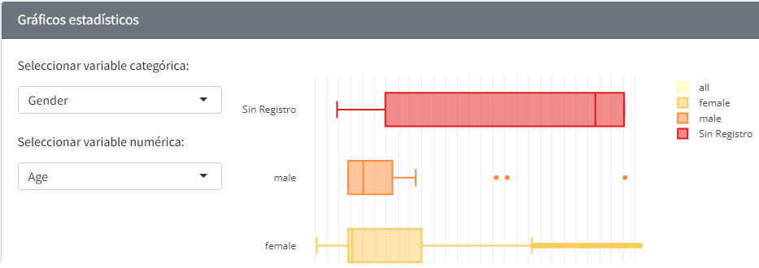
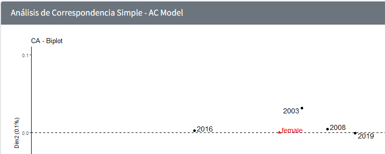
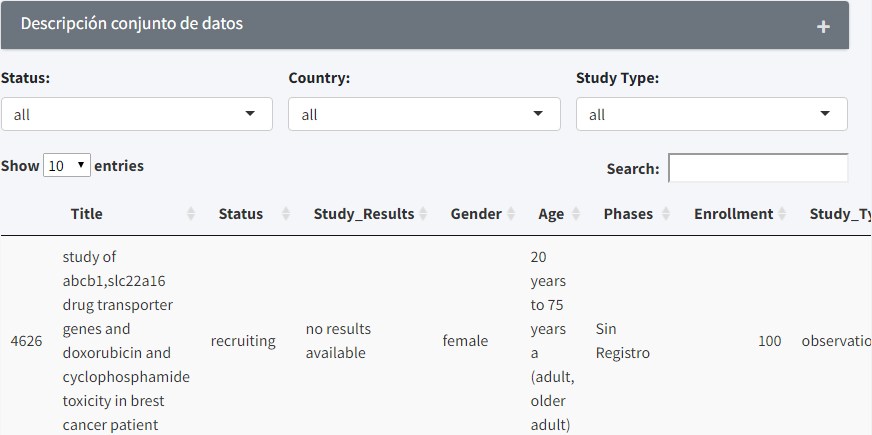

**Uso de la Aplicación:**

- Menú principal

Esta guía permite visualizar las opciones generales de la aplicación, dar un click en cualquiera de las siguientes opciones:

**Salud - Cáncer mama:** Se encuentra una breve explicación de la aplicación.

**Mapa - Inscritos:** Muestra el número de inscritos en un estudio clínico, se puede flitar por estado, tipo de estudio y resultado de estudio.

**Relaciones - Estudio:** Muestra las relaciones de un estudio clínico por países, seleccionar la opción del menú desplegable.

**Visualización:** Se muestra gráficos del conjunto de datos de los estudios clínicos de cáncer de mama que se encuentran en estado activos, terminados y completos.

**Predicción:** Se visualiza los resultados de emplear el modelo de predicción de “Análisis de Correspondencia Simple”.

**Datos:** Se puede interactuar con el conjunto de datos crudos en una tabla resumen.

