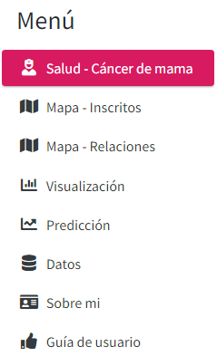

**Uso de la Aplicación:**

- Menú principal

Podemos visualizar las opciones generales del proyecto, dar un click en cualquiera de las siguientes opciones:

**Salud - Cáncer mama** - se encuentra una breve explicación de la aplicación.

**Mapa - Inscritos** - Muestra el número de inscritos en un estudio clínico, se puede flitar por estado, tipo de estudio y resultado de estudio.

**Relaciones - Estudio** Muestra las relaciones de un estudio clínico por países, seleccionar la opción del menú desplegable.

**Visualización**

**Predicción**

**Datos**

